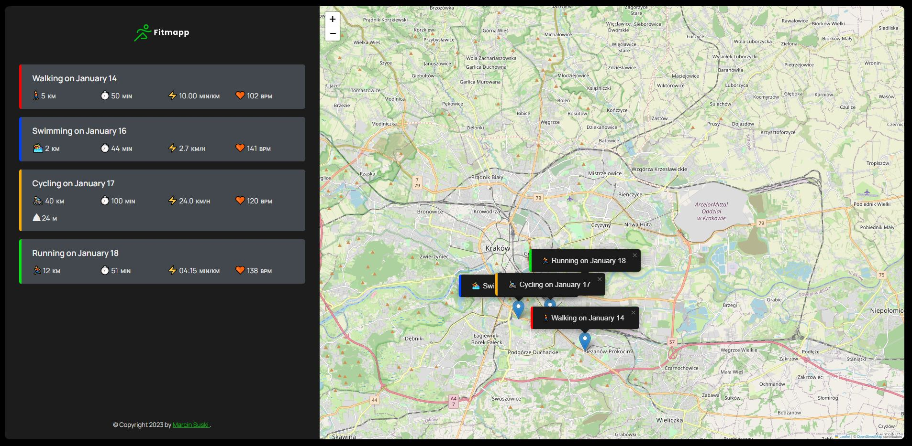

# Welcome to Fitmapp!

## 💡 Concept
A web application allowing to add training workouts of many kinds and position them on a map to track your activities and progress. 
I view it as a component of a larger training app.
 
## 🔍 Project overview 
The app now stores data in localstorage but as a part fo the larger app it will get and post data to and from back-end database.
User can point on a map to chose a location and fill the form to add the activity of available types: running, trailrunning, cycling, swimming, walking, yoga. Data are then stored, additional info (pace, speed) is calculated and all is renderd on the sidebar and as a pin on a map.
Various actities have different input fields available.
When clicked on a certain activity, map is centered on the corresponding pin.
 
Credits to Jonas Schmedtman who introduced the basics of this on his JS course.  
 
## 📦 Tech stack:
- HTML
- CSS
- JavaScript
- Leaflet library (map rendering) 
 
## ⚙ TODO
App is still in progress although it is already working to some extent. Changes I wish to make:
- add "description" input to allow more elaborate title for a workout (like a summary of what was performed on a given training session).
- rewrite everything to React and Typescript
- add backend database
- link the app with a calendar component
- In the calendar compontent one might add training plans and then add final activities that should be visible both in a calendar and on a map.
- Workout data should be collected into statistics displayed on yet another component - in a form of charts.

 
## 💻 Demo

Click the link and check the demo app: [Fitmapp-link](https://fitmapp.netlify.app/)

## ☎️ Contact
In case of any comments or advice, You can e-mail me or use Issues :)

## 🧙‍♂️ Author
- GitHub - [Marcin Suski](https://github.com/marcinsuski)
- LinkedIn - [marcin-suski](https://www.linkedin.com/in/marcin-suski/)
- Porftolio - [marcinsuski.pl](https://marcinsuski.pl)
